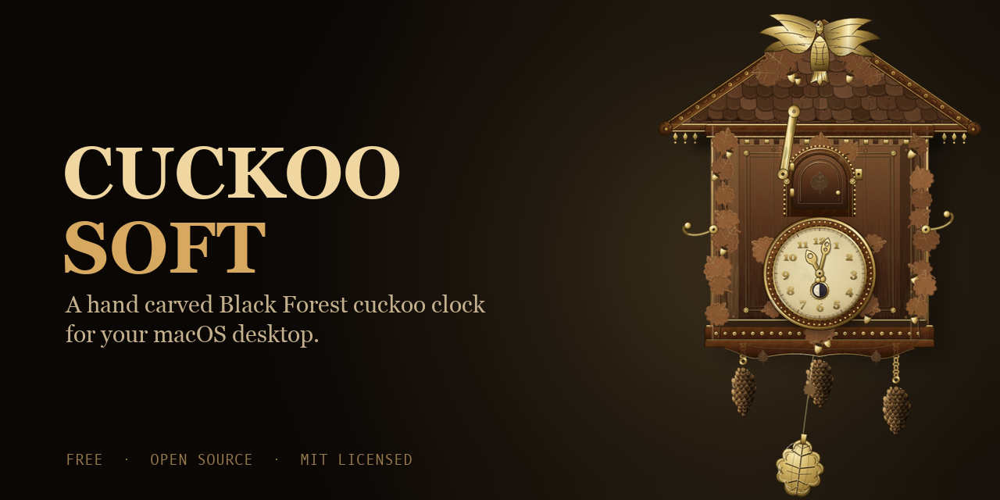
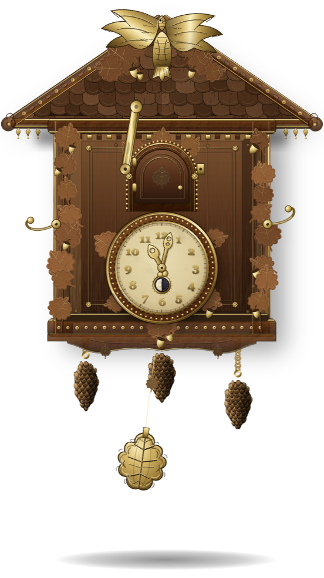
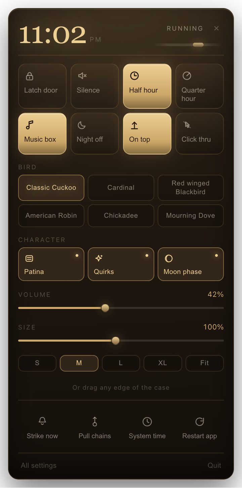
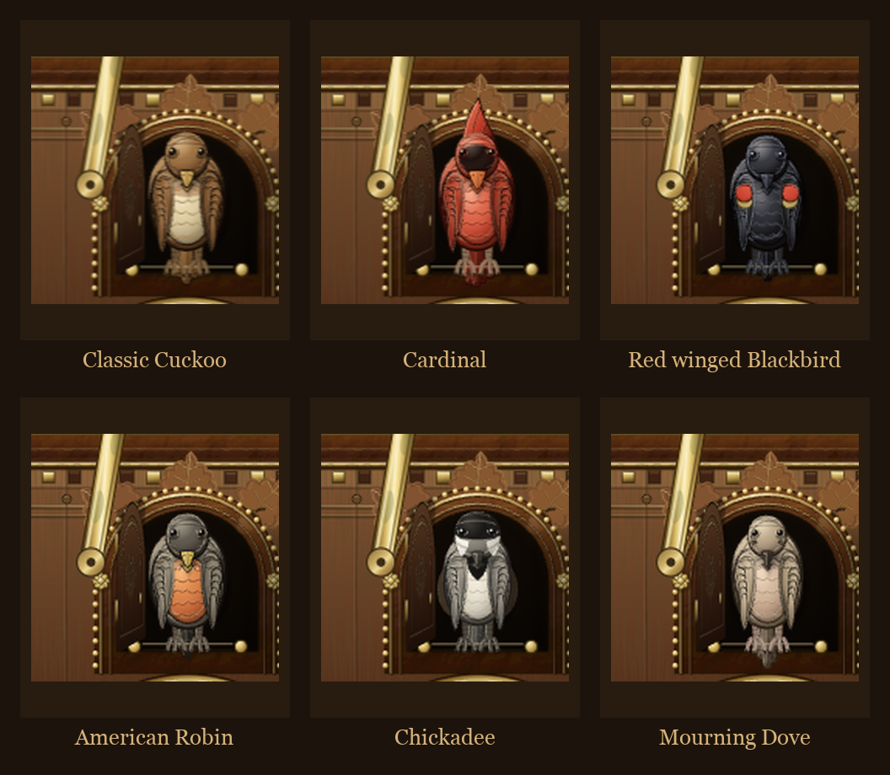

# CuckooSoft

<p align="center">
  
</p>

<p align="center">
  <a href="LICENSE"></a>
  
  
</p>

A hand carved, gilt Black Forest cuckoo clock that lives on your macOS
desktop. Real pendulum physics, real weight driven chains, an hourly cuckoo
call with a genuine bellows sound, six carved bird species that actually
look like their name, and a menu bar popover for everything else. Free and
open source, MIT licensed.

<p align="center">
  
  
</p>

## What it is

CuckooSoft is not a clock face, it is a small simulation. The pendulum swing,
the tick and tock, the weight driven chains, the cuckoo call, the bird door
and its brass latch, the night silence lever, all of it runs on real timing
and real state, not a looping animation. It sits as a transparent, frameless,
always on top window, and lives in the menu bar the rest of the time. The
case itself is gilt bronze and figured wood, mitred panels, beaded gold
rings, the kind of detail that is meant to reward actually looking closely
rather than glancing past it.

## Features

- **Real movement.** Pendulum with a regulating leaf, three weighted chains
  (time, strike, music) that visibly descend and can be wound by hand, an
  authentic drift mode for anyone who wants their clock to genuinely run fast
  or slow like the real thing.
- **A proper strike train.** Hour, half hour, and quarter hour calls (each
  independently toggleable), a wire gong timed to land while the bird is
  still out rather than into dead air, a music box waltz after the hour, a
  brass latch that physically silences the bird, and a night shut off window.
- **Six carved bird species, not six recolors.** The classic cuckoo, plus
  Cardinal, Red winged Blackbird, American Robin, Chickadee, and Mourning
  Dove, each with its own call and tick/tock pair *and* its own carved,
  shaded, correctly plumed bird behind the door. A cardinal has the crest
  and the mask, a red winged blackbird has the epaulette, a chickadee has
  the cap and the bib.

  <p align="center">
    
  </p>

- **Character.** Patina that builds with handling and age, rare unscripted
  little moments (a curious peek between calls, a caught breath in the
  pendulum), and a small moon phase ring on the dial, all independently
  toggleable.
- **A menu bar popover** for the controls worth reaching for in a hurry, and
  an exhaustive native menu for everything else.

## Using it

The case is not just decoration, most of it is a real control:

- **Drag the roof or the walls** to move the window. **Drag any edge or
  corner** to resize it freely, or use the S / M / L / XL / Fit chips in the
  popover.
- **Click the pendulum bob** to stop or start the going train, the same way
  you would still a real clock's pendulum by hand. If the clock ever seems
  to have "just stopped," this is almost always why, check the tray menu's
  "Start the pendulum" item.
- **Drag the regulating leaf** up or down the pendulum rod to run the clock
  faster or slower (only meaningful with authentic drift on).
- **Drag any of the three chains** down to wind that train back up by hand,
  or turn on Auto wind in settings to never think about it.
- **Click the latch** to silence the bird without muting the ticking.
- **Double click the dial** to reset the hands to the system clock after
  dragging the minute hand to set a custom time.
- **Right click the menu bar icon** for the full native menu, **left click**
  for the quick settings popover.

## Running it

```bash
npm install
npm start
```

`npm run dev` runs the same thing with devtools open. There is no build step
for day to day development, the renderer is plain ES2022 loaded directly.

### Building a distributable

```bash
npm run dist   # unpacked app, for local testing
npm run pack   # packaged .app
```

Both use `electron-builder` and are macOS only for now.

### Regenerating the sound pack

The clock's sounds were generated with the ElevenLabs sound effects API, not
recorded. `scripts/generate-sounds.mjs` renders several takes per sound,
scores them automatically (does it actually decay to silence, does it fill
the requested duration, does it sound the way it was asked to), and keeps the
best one. Requires an `ELEVENLABS_API_KEY`:

```bash
ELEVENLABS_API_KEY=... node scripts/generate-sounds.mjs        # everything
ELEVENLABS_API_KEY=... node scripts/generate-sounds.mjs tock   # just one sound
```

## Verifying a change

There is a self test harness that boots the real app, drives the mechanism
(does the bird actually come out, does the latch really stop it, does the
escapement tick, does every setting actually take effect), captures every
renderer console error, and screenshots the result:

```bash
CUCKOO_SELFTEST=1 CUCKOO_SHOT_DIR=/tmp/cuckoo-shots ./node_modules/.bin/electron .
```

## Project layout

```
src/main/       the going train: settings, movement, chime sequencer, tray,
                the menu bar popover window, the self test harness
src/preload/    the whole surface the renderer is allowed to touch
src/renderer/   clock.js/clock.css draw and animate the case, audio.js is the
                bellows and the escapement, panel.js/html/css are the popover
scripts/        the sound generation pipeline
assets/sounds/  the generated sound pack and its manifest
```

## Contributing

Issues and pull requests are welcome. If you touch anything in `src/main` or
`src/renderer/audio.js`, run the self test before opening a PR. If you touch
the visual layer (`src/renderer/clock.*`, `src/renderer/panel.*`), a
screenshot in the PR description goes a long way, this is a project where the
craft is the whole point.

## License

MIT, see [LICENSE](LICENSE).
